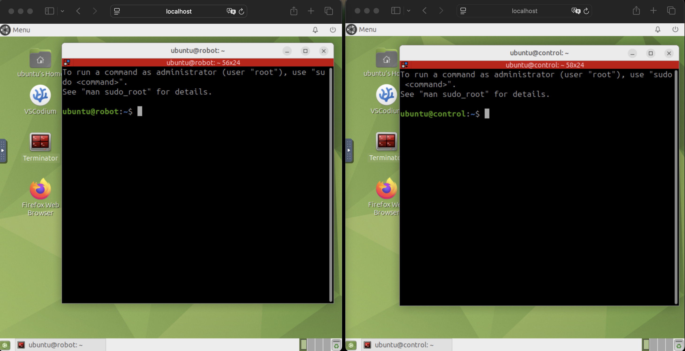

<div align="center">

  <h1>🐲 Zenoh ROSCon(s) 2025 Workshop 🇬🇧 🏴󠁧󠁢󠁳󠁣󠁴󠁿 🇸🇬 🇫🇷 🇩🇪 </h1>

  <p>
    <strong> Your first steps with Zenoh as an RMW in ROS 2 </strong>
  </p>

  <p>
    <a href="https://choosealicense.com/licenses/epl-2.0/"></a>
    <a href="https://opensource.org/licenses/Apache-2.0"></a>
  </p>

<sub>Built by the <a href="https://zenoh.io">Zenoh</a> team at <a href="https://www.zettascale.tech">ZettaScale</a> with ❤️</sub>
</div>

## About

Welcome! This repository is part of the `ROS 2 Networking Redefined: Deep Dive into RMW Zenoh` workshops, scheduled to take place at several ROSCons in 2025:

* [ROSCon UK](https://roscon.org.uk/2025/) 🇬🇧 🏴󠁧󠁢󠁳󠁣󠁴󠁿, on September 16th
* [ROSCon Singapore](https://roscon.ros.org/2025/) 🇸🇬, on October 27th
* [ROSCon FR & DE](https://roscon.ros.org/fr/2025/) 🇫🇷 🇩🇪, on November 18th

It contains all the resources you’ll need to get started with `rmw_zenoh`, the Zenoh middleware for `ROS 2`.

In this hands-on workshop, you’ll explore how to leverage Zenoh as a ROS 2 middleware (RMW) layer. Whether you're new to Zenoh or looking to deepen your understanding of it, this workshop is designed to give you practical insights through simple demonstrations.

What's Included:

* Some [introduction slides](Introduction_slides.pdf) showing an overview of both Zenoh and `rmw_zenoh`.
* Dockerized environment: Pre-configured for easy setup and reproducibility.
* Simple ROS 2 applications: Designed to showcase the use of rmw_zenoh.
* Scripts and utilities: Simplifying container management, environment setup and configuration files.

Get ready to dive into the exciting world of ROS 2 networking with Zenoh!

## Hardware requirements

A laptop on Linux, MacOS or Windows with:

* 8 cores minimum
* 16 GB RAM minimum
* 30 GB disk free minimum
* Docker installed and configured with allocated resources: 8 CPU and 16 GB memory limit

> [!warning]
>
> We strongly recommend pulling this Docker image **before your arrival at ROSCon**:
>
> ```bash
> docker pull zettascaletech/roscon2025_workshop
> ```
>
> It is available for both `amd64` and `arm64` architectures.

## Setup

Pull this repository and change to its directory:

```log
git clone https://github.com/ZettaScaleLabs/roscon2025_workshop.git
cd roscon2025_workshop
```

This workshop relies on 2 containers with ROS 2 Jazzy and RMW Zenoh installed:

* **robot**: to simulate a robot
* **control**: a host to control the robot

Run those containers with Docker compose as such:

```bash
docker compose up -d
```

Then you can open 2 VNC connections to each container in a Web browser:

* Robot container: http://localhost:6080/
* Controller container: http://localhost:6081/

If the sessions are locked, the password is `ubuntu`.



The 2 containers are based on the same image and are already configured with ROS 2 environment and `RMW_IMPLEMENTATION=rmw_zenoh_cpp`.  
A [`justfile`](docker/justfile) in home directory defines some commands shorcuts that can be called with `just <command_name>`.  
Each container has a `~/container_data` volume bound to your host's `container_volumes/robot_container` and `container_volumes/control_container` respectively.

## Exercises

### [Exercise 1 - Zenoh router and ROS nodes](exercises/ex-1.md)

### [Exercise 2 - A complete simulation with Nav2](exercises/ex-2.md)

### [Exercise 3 - Shared Memory](exercises/ex-3.md)

### [Exercise 4 - Run rviz2 to visualize the remote robot](exercises/ex-4.md)

### [Exercise 5 - Access Control](exercises/ex-5.md)

### [Exercise 6 - Downsampling](exercises/ex-6.md)

### [Exercise 7 - Adjust the QoS & Priority of topics](exercises/ex-7.md)

### [Exercise 8 - Traverse the Internet](exercises/ex-8.md)

---

## Acknowledgements

The Dockerfile is based on [Tiryoh/docker-ros2-desktop-vnc](https://github.com/Tiryoh/docker-ros2-desktop-vnc), licensed under the [Apache License 2.0](https://github.com/Tiryoh/docker-ros2-desktop-vnc/blob/c131213eadd7f4f694b94bab349fb287c1daeb11/LICENSE).

The simulation of the [ROX robot](https://www.neobotix-robots.com/products/mobile-robots/mobile-robot-rox) is courtesy of [Neobotix](https://www.neobotix-robots.com/) and comes from [neobotix/rox](https://github.com/neobotix/rox).
